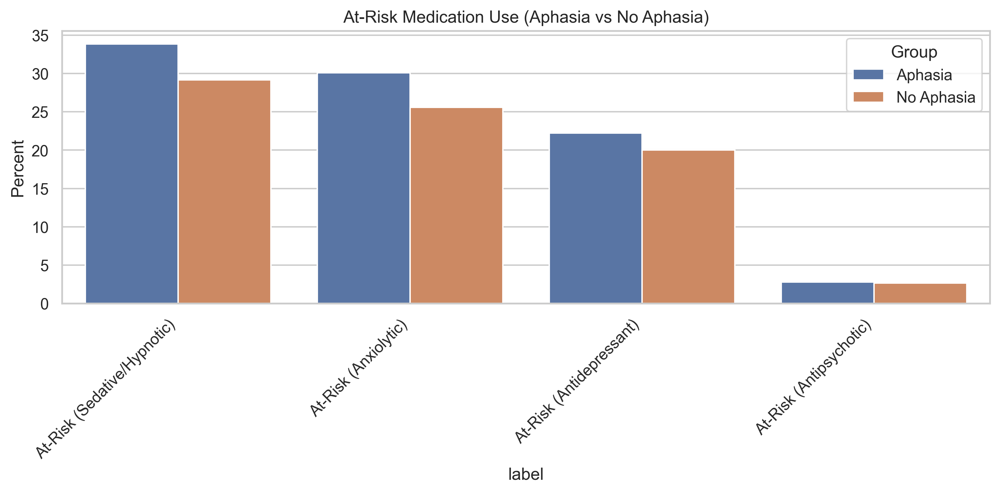

# Exploratory Data Analysis (EDA)

This page provides a high-level overview of the study cohort, including the dementia filter, aphasia split, and overall flag distributions. The purpose is to understand the characteristics of the stroke cohort *before* evaluating PIMs, polypharmacy, or readmission risk.

---

## **Cohort Overview**

### **Dementia Filter Summary**
| Metric | Value |
|-------|-------|
| Initial cohort size | **67,128** |
| Dementia removed | **10,947 (16.31%)** |
| Final cohort (no dementia) | **56,181** |

---

### **Aphasia Split (After Dementia Filter)**
| Group | Count | Percent |
|-------|-------|---------|
| Total | **56,181** | 100% |
| Aphasia | **9,108** | 16.21% |
| No Aphasia | **47,073** | 83.79% |

---

## **Flag Prevalence (All Patients)**

Below is a summary of all medication-related and condition flags, including mental-health conditions, PIM categories, at-risk medication categories, and polypharmacy markers.

---

## **Mental Health Conditions (Aphasia vs No Aphasia)**

| Condition | % All | % Aphasia | % No Aphasia | Δ (Aph – No) |
|-----------|-------|-------------|---------------|--------------|
| Depression | 24.64% | 28.11% | 23.97% | **+4.14%** |
| Anxiety | 23.09% | 23.99% | 22.92% | +1.07% |
| Seizure/Epilepsy | 11.01% | 15.57% | 10.12% | **+5.44%** |
| Psychosis | 1.92% | 1.89% | 1.93% | −0.04% |
| Bipolar Disorder | 1.77% | 1.68% | 1.78% | −0.10% |
| PTSD | 0.98% | 0.82% | 1.02% | −0.19% |
| Schizophrenia | 0.59% | 0.52% | 0.61% | −0.09% |

---

## **Medication Class Use (Aphasia vs No Aphasia)**

| Medication | % All | % Aphasia | % No Aphasia | Δ |
|-----------|--------|-----------|---------------|------|
| Antidepressant | 21.87% | 24.13% | 21.43% | +2.70% |
| Anxiolytic | 6.27% | 6.35% | 6.26% | +0.09% |
| Antipsychotic | 3.05% | 2.94% | 3.07% | −0.12% |
| Sedative/Hypnotic | 2.43% | 2.26% | 2.47% | −0.21% |

---
## **At-Risk Medication Use (Aphasia vs No Aphasia)**

| Patient Characteristic        | # All Patients | % All Patients | # Aphasia | % Aphasia | # No Aphasia | % No Aphasia | % Difference (Aphasia − No Aphasia) |
|------------------------------|----------------|----------------|-----------|-----------|--------------|---------------|--------------------------------------|
| At-Risk (Sedative/Hypnotic)  | 16,820         | 29.94%         | 3,084     | 33.86%    | 13,736        | 29.18%       | 4.68%                                |
| At-Risk (Anxiolytic)         | 14,775         | 26.30%         | 2,740     | 30.08%    | 12,035        | 25.57%       | 4.52%                                |
| At-Risk (Antidepressant)     | 11,443         | 20.37%         | 2,024     | 22.22%    | 9,419         | 20.01%       | 2.21%                                |
| At-Risk (Antipsychotic)      | 1,510          | 2.69%          | 254       | 2.79%     | 1,256         | 2.67%        | 0.12%                                |

---

## **Grouped PIM Rates (Aphasia vs No Aphasia)**

Patient Characteristic | # (All Patients) | % (All Patients) | # (Aphasia) | % (Aphasia) | # (No Aphasia) | % (No Aphasia) | % Difference (Aphasia − No Aphasia)
--- | --- | --- | --- | --- | --- | --- | ---
Antidepressant PIM | 3543 | 6.306403 | 643 | 7.059728 | 2900 | 6.160644 | 0.899084
Antipsychotic PIM | 1075 | 1.913458 | 195 | 2.140975 | 880 | 1.869437 | 0.271538
Anxiolytic PIM | 795 | 1.415069 | 132 | 1.449275 | 663 | 1.408451 | 0.040825
Sedative/Hypnotic PIM | 685 | 1.219273 | 104 | 1.141853 | 581 | 1.234253 | -0.092400

## **Key Takeaways**

- The aphasia subgroup has higher rates of depression, anxiety, and seizure disorders, all of which are clinically relevant to medication safety.
- Medication usage is modestly higher for antidepressants and anxiolytics in the aphasia group.
- These patterns justify further analysis of how these medications relate to PIMs and readmission risk.

---
