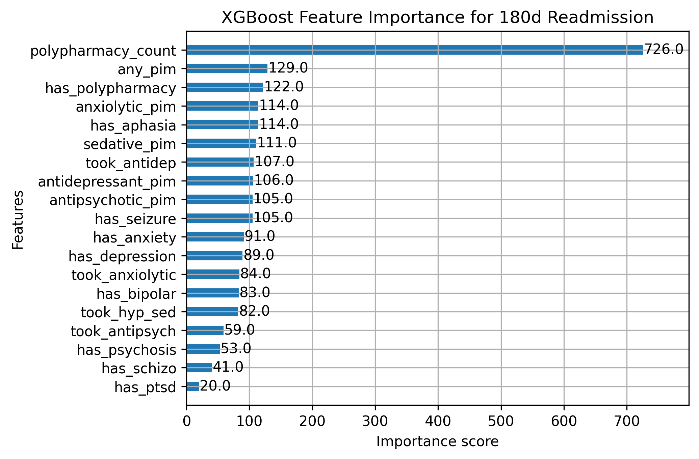
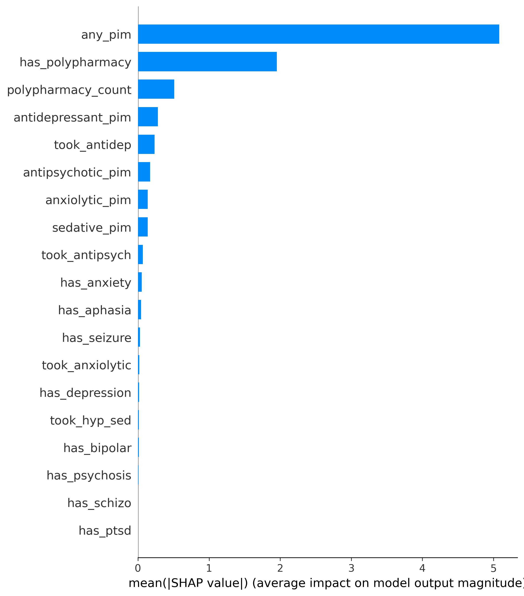

# XGBoost Readmission Prediction Model  
_Aphasia vs No Aphasia | Medication Flags | Polypharmacy_

---

## 1. Overview

This page summarizes the development, tuning, and interpretation of an XGBoost model predicting **180-day hospital readmission** using medication flags, mental-health flags, aphasia status, and polypharmacy patterns.

The workflow includes:
- Data preparation & feature selection  
- Train/test split  
- Hyperparameter tuning (reduced grid)  
- Model training with F1 optimization  
- SHAP value explanation  
- Saved image outputs (feature importance, SHAP summary, dependence plots)

---

## 2. Features Used

**Binary flags:**

- `has_aphasia`
- Mental-health flags: `has_anxiety`, `has_bipolar`, `has_depression`, `has_psychosis`, `has_ptsd`, `has_schizo`, `has_seizure`
- Medication exposure flags:  
  `took_antidep`, `took_anxiolytic`, `took_hyp_sed`, `took_antipsych`
- PIM flags:  
  `antidepressant_pim`, `anxiolytic_pim`, `sedative_pim`, `antipsychotic_pim`, `any_pim`
- Polypharmacy indicators:  
  `has_polypharmacy`, `polypharmacy_count`

**Outcome:**  
`readmission_180d` (binary)

---

## 3. Model Training Summary

- Train/test split: **80/20**, stratified  
- Metric optimized: **F1** (better for rare readmissions)  
- Algorithm: `XGBClassifier` (XGBoost)  

## 4. Model Evaluation 

These images should be saved in your repo and referenced here.

### **XGBoost Feature Importance**

The Xgboost model did a good job with the recall but a bad job with the precision for the positive class. This means that the model captured all of the cases of hospital readmission but had some false positives. This happens because there were only a small amount of the population that had hospital readmissions. This is common with medical research of rare events. The model does still have some usefulness as an explanitory model, but should not be used in a medical environement since there would be medical cost waste and patients worry. 

### **Precision-Recall Curve**

---

## 5. SHAP Interpretability

 In order to get a bigger look into the relationship between the features and their importance to the model SHAP was used. SHAP, which stands for Shapley Additive Explanations, is a method used to explain the predictions made by machine learning models. SHAP assigns each feature a value that represents how much that feature contributed to the model’s prediction for a specific observation.

### ** SHAP Summary**

### ** Top Features (SHAP Bar Plot)**

### **SHAP Dependence Plots**
Key variables:

- `any_pim` 
- `has_polypharmacy`  
- `polypharmacy_count`  
- `antidep_pim`  
- `took_antidep`  

---

## 6. Key Insights from the Model

### **Strong Predictors**
- **Polypharmacy** (both binary and continuous count) was consistently the dominant predictor.
- **PIM exposure** (especially antidepressant and sedative/hypnotic) increased predicted readmission risk.
- **Depression & anxiety flags** had moderate influence.
- **Aphasia status** had a small but noticeable effect in interaction with medication variables.

### **Protective or Neutral Predictors**
- Some mental-health flags (e.g., bipolar, schizophrenia) showed low direct SHAP impact.  
- Aphasia alone was not as predictive as its combination with medication complexity.

---

## 7. Discussion

The XGBoost analysis reinforces a central pattern seen throughout your earlier statistical results:

### **1. Medication complexity — not aphasia — is the primary driver.**
Polypharmacy count and PIM indicators dominate the feature importance, suggesting that **medication burden** outweighs language/cognitive symptoms in predicting readmission.

### **2. Aphasia interacts with medication patterns.**
While aphasia alone has modest predictive power, the SHAP interaction effects show that **aphasia + high polypharmacy** produces elevated predicted risk.  
This aligns with earlier chi-square findings showing small but consistent differences in medication patterns.

### **3. Mental-health conditions contribute but are secondary.**
Depression and anxiety provide meaningful signal, consistent with your earlier flag-count summaries.  
Psychosis and bipolar disorder were weak predictors.

### **4. PIM exposure adds compounding risk.**
Although PIM prevalence is low, the model captures their disproportionate impact on readmission, especially sedative/hypnotic PIMs.

---

## 8. Conclusions

- **Medication complexity is the clearest actionable risk factor.**  
  Interventions reducing unnecessary prescriptions could meaningfully reduce readmissions.

- **Polypharmacy may be a better clinical stratification tool than aphasia alone.**

- **Aphasia does not independently drive readmission**, but interacts with medication complexity in ways clinicians should monitor.

- **SHAP improves interpretability**, showing *how* medications and conditions interact.

---
